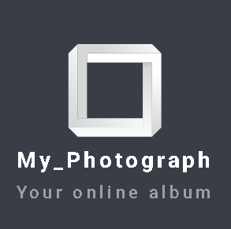
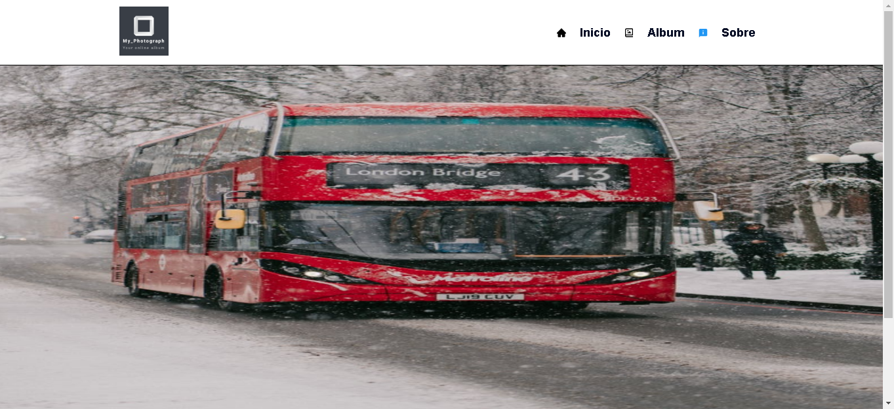
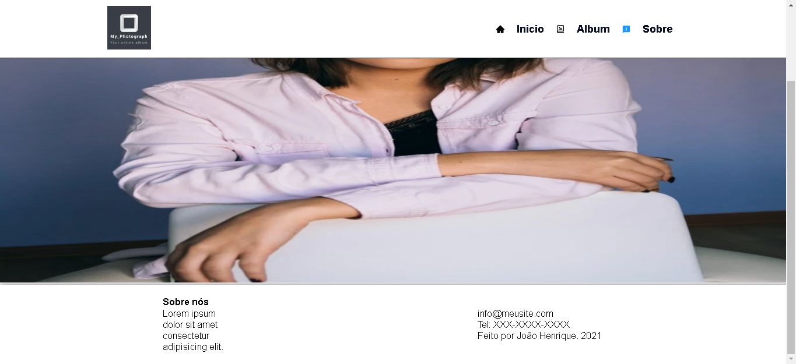
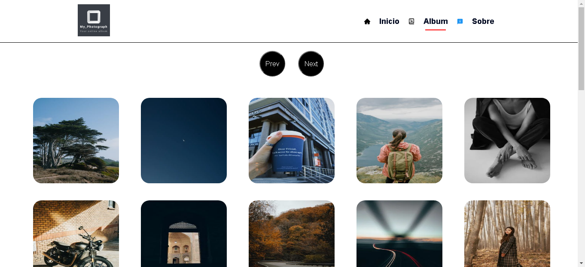
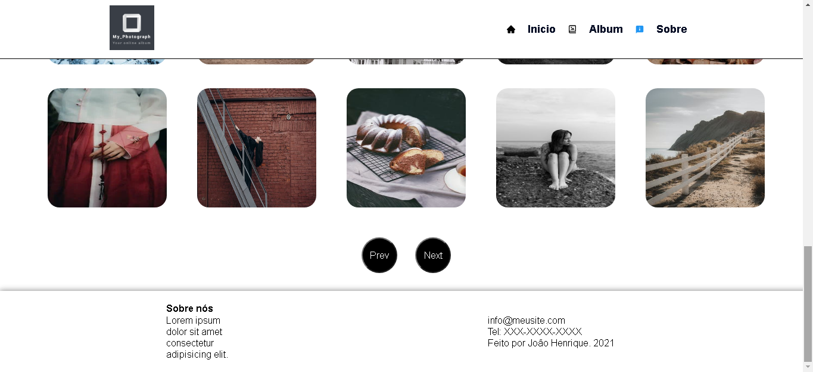
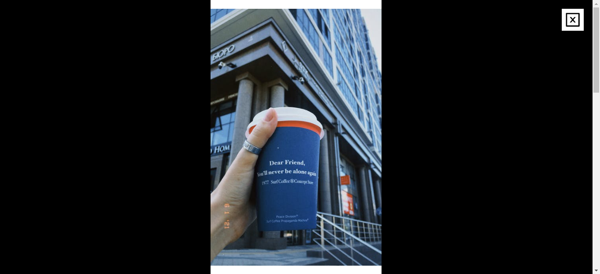
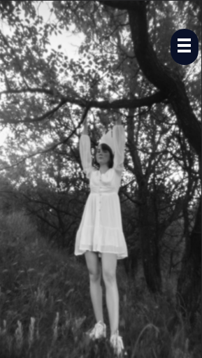
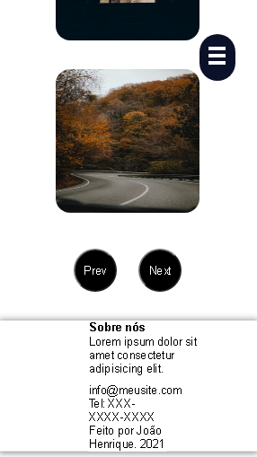
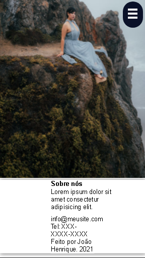
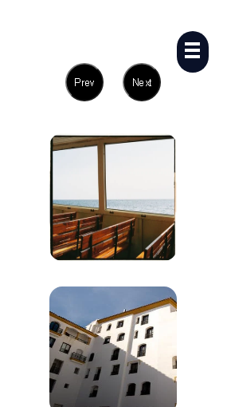

# MY_PHOTOGRAPH
[](https://github.com/henriquepython/photographyalbum/blob/main/LICENSE) 

# Sobre o projeto

Link do deploy: https://myphotograph2021.netlify.app/


MY_PHOTOGRAPH é uma aplicação front-end web totalmente responsiva construída como resposta de uma atividade.

A aplicação consiste em um site totalmente responsivo, para um album de fotos, onde para esse site as fotos foram carregadas da API pexels.

O site consiste em duas telas, a primeira tela é o inicio que é a tela principal que consiste num cabeçalho onde esta localizado o menu com três links, inicio, album e sobre, um slide carrosel interativo onde as imagens são exibidas em forma de slide e vão passando automaticamente ou se preferir arrastando a imagem para a esquerda ou direita, e um rodapé. e a segunda tela é o album, que é uma galeria onde as imagens estão guardadas e listadas em 30 imagens por pagina, e atraves de dois botões o next para avançar a pagina, e prev para voltar para a pagina anterior é realizado a paginação da galeria, ainda sendo possivel ver a imagem em tamanho real ao clicar nela. a pagina album é composto por um cabeçalho, galeria e rodapé.

## GIF

## Layout web






## Layout mobile






# Tecnologias utilizadas
## Front end
- HTML / SASS / JS 
- ReactJs
- Axios
## Implantação em produção
- Front end web: Netlify

# Como executar o projeto

## Front end web
Pré-requisitos: npm

```bash
# clonar repositório
git clone https://github.com/henriquepython/photographyalbum

# entrar na pasta do projeto front end web
cd photographyalbum

# instalar dependências
npm install

# executar o projeto
npm start
```

# Autor

João Henrique Batista Cerqueira

https://www.linkedin.com/in/jo%C3%A3o-henrique-batista-pereira/